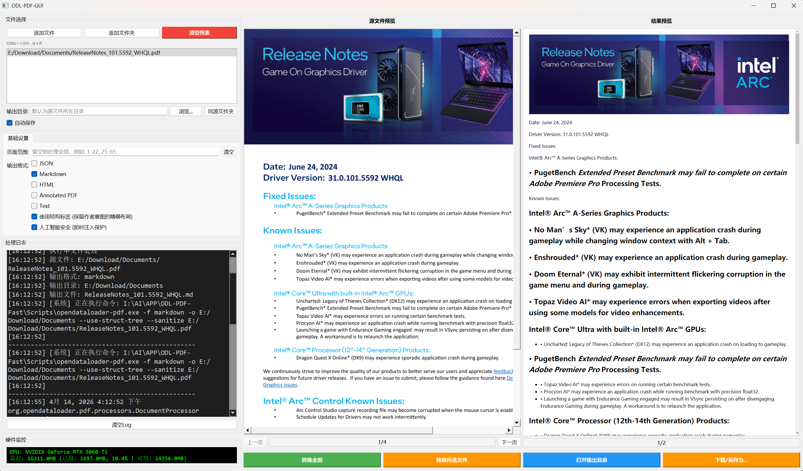

# ODL-PDF-Fast-GUI

一个基于 PyQt5 开发的可视化 GUI 工具，用于简化 `opendataloader-pdf` 工具的使用流程，支持 PDF 文件的批量转换、格式选择、页面范围筛选以及实时预览和硬件监控等功能。



基于opendataloader-project/opendataloader-pdf的fast模式。只能转换非图片类的PDF，需要处理公式，复杂表格请使用Hybrid模式（见https://github.com/opendataloader-project/opendataloader-pdf）。
因为Hybrid模式使用Docling，但Docling有点问题，所以本工具没有支持Hybrid模式。

复杂的PDF建议使用OpenOCR（https://github.com/Topdu/OpenOCR），
基于百度飞桨，效果很好，本人也做了对应的GUI工具，请自行下载。

---

## 🌟 功能特性

- **文件管理**：支持单文件 / 多文件 / 文件夹批量添加 PDF 文件
- **格式输出**：支持 JSON、Markdown、HTML、Annotated PDF、Text 等多种输出格式
- **页面筛选**：支持指定页面范围（如 `1-22, 25-65`）进行精准转换
- **实时预览**：源文件 PDF / 图片预览 + Markdown 结果实时渲染预览
- **批量处理**：支持多文件批量转换，自动处理不同目录文件
- **硬件监控**：实时 GPU 显存监控（需安装 GPUtil）
- **灵活输出**：自定义输出目录，支持自动重命名避免文件覆盖
- **日志记录**：完整的转换日志记录，便于问题排查

## 📋 依赖清单

### 核心依赖

txt

```
PyQt5 >= 5.15.0
PyQtWebEngine >= 5.15.0
PyMuPDF >= 1.23.0  # fitz
markdown >= 3.4.0
requests >= 2.31.0
GPUtil >= 1.4.0    # 可选，GPU监控功能
opendataloader-pdf  # 核心转换工具
```

### 可选依赖

- `GPUtil`：用于 GPU 硬件监控，不安装仅影响监控功能，不影响核心转换

## 🚀 安装步骤

### 1. 环境准备

建议使用虚拟环境（venv/Conda）：

bash

运行

```
# 创建虚拟环境（venv）
python -m venv odl-env

# 激活环境
# Windows
odl-env\Scripts\activate
# Linux/Mac
source odl-env/bin/activate
```

### 2. 安装依赖包

bash

运行

```
# 安装基础依赖
pip install PyQt5 PyQtWebEngine PyMuPDF markdown requests

# 可选：安装GPU监控依赖
pip install GPUtil

# 安装核心转换工具（根据实际包名调整）
pip install opendataloader-pdf
```

### 3. 运行 GUI

bash

运行

```
python odl-pdf-Fast-GUI.py
```

## 📖 使用指南

### 基础操作流程

1. **添加文件**：
    
    - 点击「添加文件」：选择单个 / 多个 PDF 文件
    - 点击「添加文件夹」：选择包含 PDF 的文件夹（自动遍历所有 PDF）
    - 点击「清空列表」：清空已添加的文件列表
    
2. **输出设置**：
    
    - **输出目录**：自定义输出目录（留空则使用源文件所在目录）
    - **同源文件夹**：快速重置输出目录为源文件目录
    - **自动保存**：默认勾选，转换完成后自动保存到输出目录
    
3. **格式与页面设置**：
    
    - **输出格式**：勾选需要的输出格式（默认 Markdown）
    - **页面范围**：输入需要转换的页面范围（如 `1-10`、`5,8,10-20`，留空处理全部页面）
    - **高级选项**：
        
        - 使用结构标签：保留作者意图的精确布局
        - 人工智能安全：启用即时注入保护
        
    
4. **执行转换**：
    
    - **转换全部**：处理列表中所有文件
    - **转换所选文件**：仅处理列表中选中的单个文件
    - **打开输出目录**：快速打开输出文件夹
    - **下载 / 另存为**：手动保存转换结果
    
5. **预览功能**：
    
    - 源文件预览：选中文件后自动预览，支持上下页切换
    - 结果预览：转换完成后自动加载 Markdown 渲染结果
    

### 批量处理说明

- 当添加的文件来自**同一目录**：自动批量处理，输出到指定目录
- 当添加的文件来自**不同目录**：自动分别处理，输出到各自源文件目录（或自定义目录）
- 自动重命名：避免同名文件覆盖，生成带序号 / 页面范围的文件名

## ⚠️ 常见问题

### 1. "GPUtil 未安装" 提示

- 不影响核心功能，仅 GPU 监控不可用
- 如需启用：执行 `pip install GPUtil`

### 2. 转换失败 / 退出码非 0

- 检查日志窗口中的错误信息
- 确认 `opendataloader-pdf` 已正确安装且可执行
- 确认输入的页面范围格式正确（如 `1-10` 而非 `1~10`）
- 确认 PDF 文件未损坏、未加密

### 3. 预览窗口无法显示 PDF

- 确认 PyMuPDF 已正确安装：`pip install --upgrade PyMuPDF`
- 确认 PDF 文件路径无特殊字符（如中文 / 空格建议使用英文路径）

### 4. 输出文件未找到

- 检查输出目录设置（默认在源文件同目录）
- 检查日志中的文件重命名记录
- 确认转换任务已完成（日志显示「转换任务完成」）

## 🛠️ 开发说明

### 核心类说明

- `ODLWorker`：后台线程类，处理转换任务，避免 UI 阻塞
- `ODLGUI`：主窗口类，负责 UI 渲染和业务逻辑处理
- 关键功能：
    
    - `get_tool_executable`：兼容不同虚拟环境的可执行文件查找
    - `render_source_page`：PDF / 图片预览渲染
    - `run_single_file_conversion`/`run_batch_conversion`：单文件 / 批量转换逻辑
    

### 自定义扩展

- 新增输出格式：修改 `get_selected_formats` 方法和 UI 中的格式复选框
- 新增硬件监控：扩展 `update_gpu_info` 方法
- 自定义命令参数：在 `start_conversion` 中扩展命令参数构建逻辑

## 📄 许可证

本项目基于 MIT 许可证开源（根据实际情况调整），请遵守 `opendataloader-pdf` 的开源协议。

## 📞 问题反馈

如遇使用问题，请提供：

1. 日志窗口的完整错误信息
2. 操作系统版本 + Python 版本
3. 相关 PDF 文件的基本信息（页数、是否加密等）
